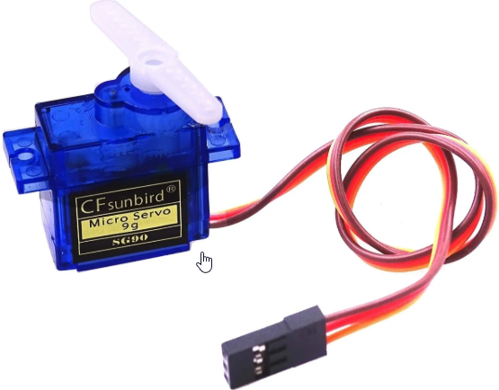
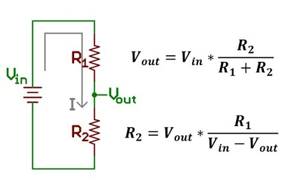
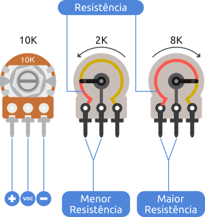
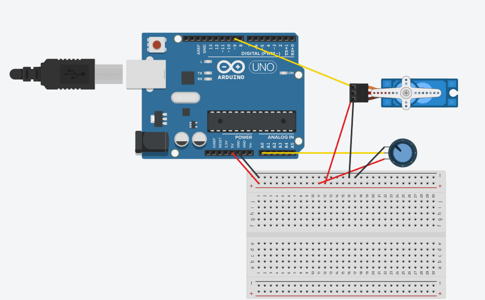
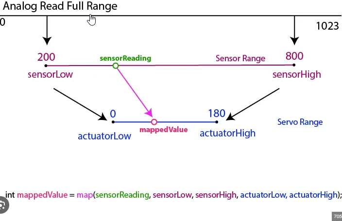

# Controle do Servo Motor
## O que é um servo motor?
"O servomotor é um atuador eletromecânico, que apresenta movimento proporcional a um comando, como dispositivos de malha fechada, ou seja: recebem um sinal de controle eletrônico; que verifica a posição atual para controlar o seu movimento indo para a posição desejada com velocidade monitorada externamente sob feedback de um dispositivo denominado taco ou sensor de efeito Hall ou encoder, dependendo do tipo de servomotor e aplicação." - Wikipédia

### Em resumo, você tem 3 pinos um positivo, um ground e um de controle, você coloca uma tensão intermediária no pino de controle e ele vai pra posição desejada.
### Se quiser pode testar colocar algumas saídas PWM em um pino e ver o que acontece.

## Exercício: controlando um Leme com um controle remoto.
### Tirando o fato que não vamos utilizar um controle remoto agora, quando usarmos o procedimento vai ser idêntico.

### O comando que vamos utilizar é o `analogRead(pin)` onde pin é um dos pinos de entrada analógica do arduino, ex: A0. O comando retorna um valor de 0 a 1023 (onde 0 = 0v e 1023 = 5v). O valor retornado deve ser guardado em uma variável

### A ideia seria ler o receptor do controle, mas por agora vamos utilizar um circuito que imita isso: um divisor de tensão. Será usado simplesmente para produzir uma tensão intermediária que será lida pelo arduino

### No lugar de dois resistores fixos vamos usar um potenciometro, um resistor variável. de modo que a soma entre as pernas da ponta sempre seja 10KOhm e na perna do meio tenhamos uma tensão intermediária

### Coloque as pernas da ponta no 5v e ground e a perna do meio em uma entrada analógica usando os jumpers.

### Em seguida coloque o servo, 5v, ground, e o sinal em usa saída PWM

### Por fim um último problema, o analogRead() vai de 0 a 1023, mas o analogWrite() vai de 0 a 255. Poderia dividir por 4, mas não é nada elegante, vamos usar uma função muito comum para essa aplicação, a função `map(x, in_min, in_max, out_min, out_max)`, ela meio q faz uma regra de três pra converter um valor de um intervalo de entrada pra um intervalo de saída.

### Agora envie a tensão remapeada para o servo e veja a mágica acontecer, você pode controlar a posição do servo movendo o potenciômetro

