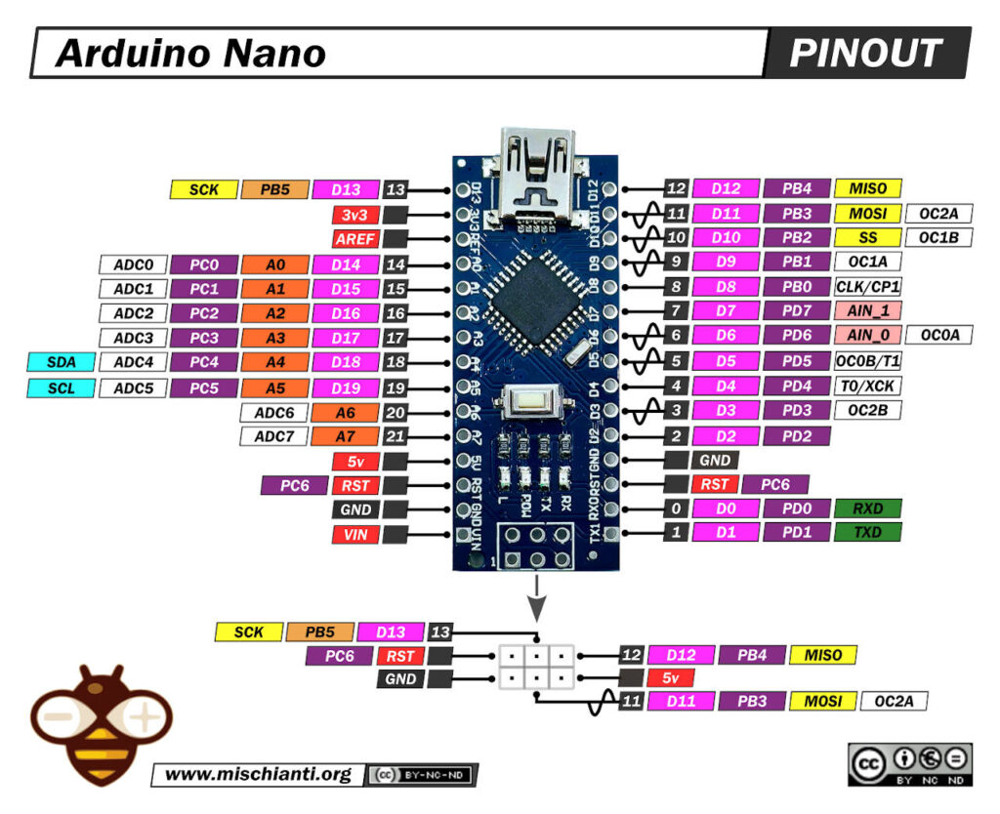

# Aula de fritzing e kicad

## Do protótico a PCB: Visão Geral
### Basicamente essa é uma aula para ensinar vocês a planejar um projeto, criar visualizações no fritzing e projetar uma PCB no Kicad

## Fritizing X Kicad
### O fritzing é bonitinho, tem peças coloridas, uma biblioteca enorme, você pode só baixar mais peça online e é facil de mexer
### Já o Kicad é mais profissional e dificil de mexer, dá pra fazer PCB multicamada
### Nos dois vocês conseguem prototipar e fazer uma PCB, mas o fritzing é bem limitado na hora de fazer PCB e o Kicad vai ficar uma merda de entender o protótipo

## Download e instalação
### Fritizing: Entra nesse link, baixa e extrai, tem um executável dentro, não precisa nem instalar [Link](https://www.youtube.com/redirect?event=video_description&redir_token=QUFFLUhqbHdma2VNT3VmazJ4YzJDaV9nN2FSc0RrUjhBd3xBQ3Jtc0tsdExXYl95bnllVm1ZQTlQRENNMGtkOWtOSnJkbTluSUlGUDZoeXV6d3laOXNlSEtWUGZvb0pZUWhtdVFQN2RnXzJGcEhPR0ROdGdkQ3BUVmJ5cmNGaW94YXdmN1l0ZVlIUXpxZVhpRFpUbFZMZ1o5SQ&q=https%3A%2F%2Fgithub.com%2Ffritzing%2Ffritzing-app%2Freleases%2Fdownload%2FCD-548%2Ffritzing-3d61c58421bdb63ca903bb5d11310a257f1ec0ed-develop-548.windows.64.zip&v=_831Gny-2vE)

### Kicad: Entra [Aqui](https://www.kicad.org/download/), baixa, next, next, finish.

## Glossário (pq nem eu sabia oq são essas coisas)
### EDA (Electronic Design Automation): Conjunto de ferramentas de software que automatiza o desenho, análise e documentação de circuitos eletrônicos (esquemáticos, PCB, simulação).Fritzing e KiCad são ambas ferramentas EDA.

### Gerber (RS‑274X): Formato padrão de arquivos 2D para camadas de PCB (cobre, máscara, silk). Cada layer vira um arquivo .gbr; acompanhado por drill files (.drl) para furos. É o “PDF” da fabricação: fábricas de PCB entendem Gerber para photoplotting. Gerar/validar Gerbers é passo obrigatório antes de mandar produzir.

### Pipeline EDA (fluxo)
### Ideia → Breadboard (Fritzing) → Esquemático (Fritzing) → Migração → Esquemático (KiCad) → Footprints → Roteamento → Gerber/BOM → Fabricação

## Missão de hoje fazer aquelas duas montagens no fritzing e no Kicad
### Vamos usar um arduino nano ao invés do aruino UNO.

### Vocês devem baixar qualquer modelo que não estiver no programa

### tutorial do indiano 
https://www.youtube.com/watch?v=XiLnHYSrNHw

