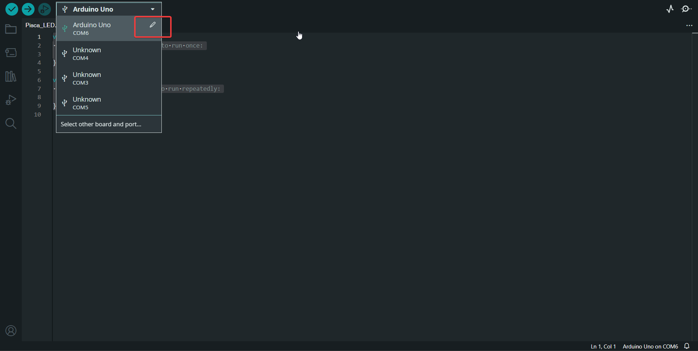
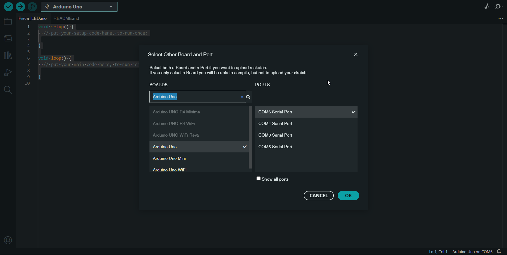

# SUA MISSÃO AQUI É FAZER UM LED PISCAR NO ARDUINO
## 1. Faça download do arduino IDE
https://www.arduino.cc/en/software/

## 2. Configurar a placa Arduino Uno
### Selecione o menu da imagem e clique em editar

### Busque por arduino Uno e selecione uma porta USB (dica pra encontrar qual delas voce conectou o arduino tenta conectar e desconectar)

## 3. Escrever seu código
### No arquivo `Pisca_LED.ino` você irá encontrar isso:
```
void setup() {
  // put your setup code here, to run once:

}

void loop() {
  // put your main code here, to run repeatedly:

}
``` 

### Basicamente são duas funções que executam por padrão no arduino, o setup() executa primeiro e apenas uma vez. Já o loop() executa várias vezes indefinidamente.

### Para essa parte usaremos dois comandos
### `void pinMode(pin, mode)` indica pra placa qual pino será usado, e qual o modo, nesse caso `OUTPUT` 

### Escolha um pino para usar (importante, o pino deve ter a função PWM):


## O que é PWM?
### Basicamente estamos trabalhando com um sistema digital, ou seja, a placa consegue emitir apenas dois estados HIGH/LOW (Ligado/Desligado, 5v/0v)
### Mas e se quisermos enviar uma tensão intermediária?
### A solução é pulsar o sinal muito rápido, ao ponto que a gente não perceba que está piscando, como se a tensão enviada fosse uma média entre o tempo que está em alta e o tempo que está em baixa, assim é como se um duty clycle de 50% representasse 2,5v


### No caso do arduino o duty cycle é configurado com um valor de 0 a 255 (onde 0 representa o tempo todo desligado e 255 o tempo todo ligado)

### Estamos usando um LED de 3v, calcule o valor de saída para que ele não queime (entre 0 e 255)

### Usaremos o comando `analogWrite(pin, val)` dentro da função loop().

### Para fazer piscar vamos usar o comando `delay(time)` que recebe o tempo em milissegundos.

### Agora utilize o que aprendeu para fazer com que o LED pisque com período de 1 segundo.
